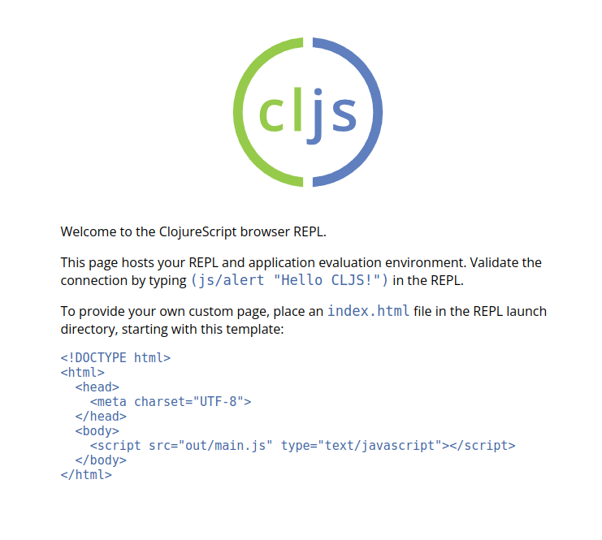
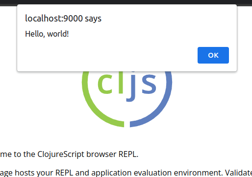

# :money_with_wings: Введение в веб-разработку на ClojureScript

**Все примеры описанные ниже можно найти в папке examples.**

## Введение

### ClojureScript

Как уже упомяналось [ранее](motivation.md), ClojureScript - это компилятор для программ, написанных на Clojure, которые в результате компилируются в JavaScript. Также ClojureScript совместим с расширенным режимом компиляции оптимизирующего компилятора Google Closure.

### Почему именно JavaScript?

Распространение браузера и веб-приложений популяризировало JavaScript. Из-за важности своего движка JavaScript также подвергаются обширным исследованиям и оптимизациям, что позволяет ему конкурировать по производительности со многими другими устоявшимися платформами, такими как JVM.

## Установка

А теперь более подробно рассмотрим: как настроить своё окружение под веб-разработку и написать свою первую программу.

### Ubuntu 

Установка уже была рассмотрена [здесь](installation.md).

Если у Вас ОС Ubuntu и Вы решили "окунуться" в мир веба, то следующие шаги являются **обязательными**:

1. Установка зависимостей:
```bash
sudo apt install bash curl default-jdk rlwrap
```

2. Установка скрипта:
```bash
curl -LO https://download.clojure.org/install/linux-install-1.11.1.1252.sh
```

3. Выдача прав скрипту на выполнение:
```bash
chmod +x linux-install-1.11.1.1252.sh
```

4. Запуск скрипта:
```bash
sudo ./linux-install-1.11.1.1252.sh
```

### Другая ОС

Установку ClojureScript на свою ОС можете посмотреть на [официальном сайте ClojureScript](https://clojurescript.org/guides/quick-start).

## Quick Start

После успешной установки ClojureScript и его зависимостей давайте напишем свою первую программу.

### Структура проекта

Создадим следующие файлы и папки:
```bash
hello-world
├── deps.edn
└── src
    └── main.cljs
```

Содержимое файла `deps.edn`:
```clojure
{:deps {org.clojure/clojurescript {:mvn/version "1.11.54"}}}
```

Содержимое файла `src/main.cljs`:
```clojure
(ns main)

(js/console.log "Hello, world!")
```

### Запуск

Чтобы скомпилировать и запустить данный проект нужно ввести:
```bash
clj -M --main cljs.main --compile main --repl
```

После запуска откроется браузер, и можно будет увидеть следующую картинку:



Если ваш браузер не открылся, то данную страницу можно увидеть самостоятельно, перейдя на [http://localhost:9000](http://localhost:9000).

В терминале, в котором была запущена программа можно увидеть версию Clojure и приглашение ко вводу:
```bash
ClojureScript 1.11.54
cljs.user=>
```

Стоит отметить, что данный процесс связан с браузером. Для проверки стоит ввести:
```clojure
(js/alert "Hello, world!")
```

И Вы после ввода команды увидите в на своей странице следующее:



Также стоит обратить внимание на следующее: если Вы завершите завершите данный процесс, то также страница **перестанет работать**.

Поздравляем, Вы написали своё веб-приложение на ClojureScript! 

[Предыдущий шаг](./use_cases.md)
[Следующий шаг](./cljs_with_react.md)
